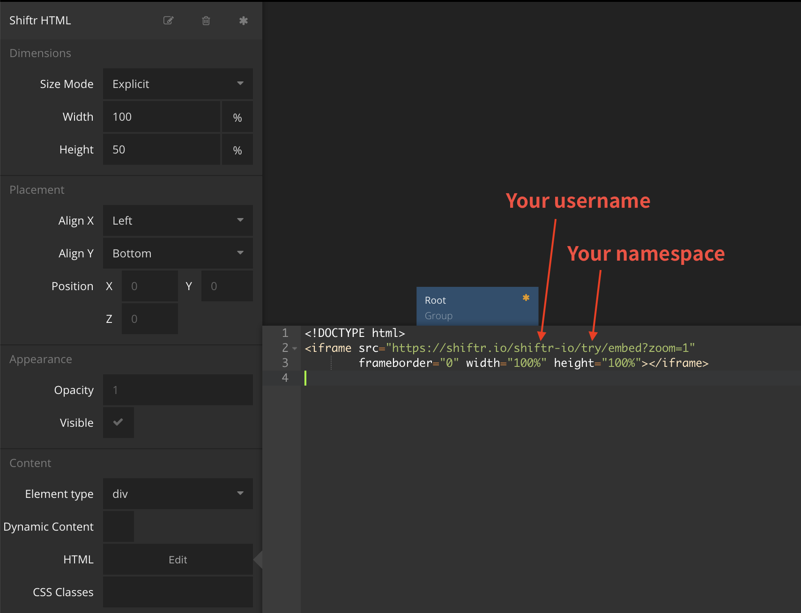

# shiftr.io in Noodl

This is a [Noodl](https://tensorx.co.jp/noodl-jp/) project. You need [Noodl installed](https://classic.getnoodl.com/download) to view and run this app.

You can view MQTT transmisson through [shiftr.io](https://shiftr.io) directly from Noodl viewer.

## Sample Page
https://kn1cht.github.io/shiftrio-in-noodl-example/

## Usage
Select "Shiftr HTML" node and open HTML editor.
You can monitor your own shiftr.io namespace by simply setting username and namespace in the HTML source.

